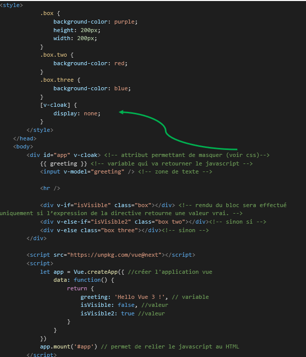
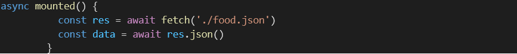
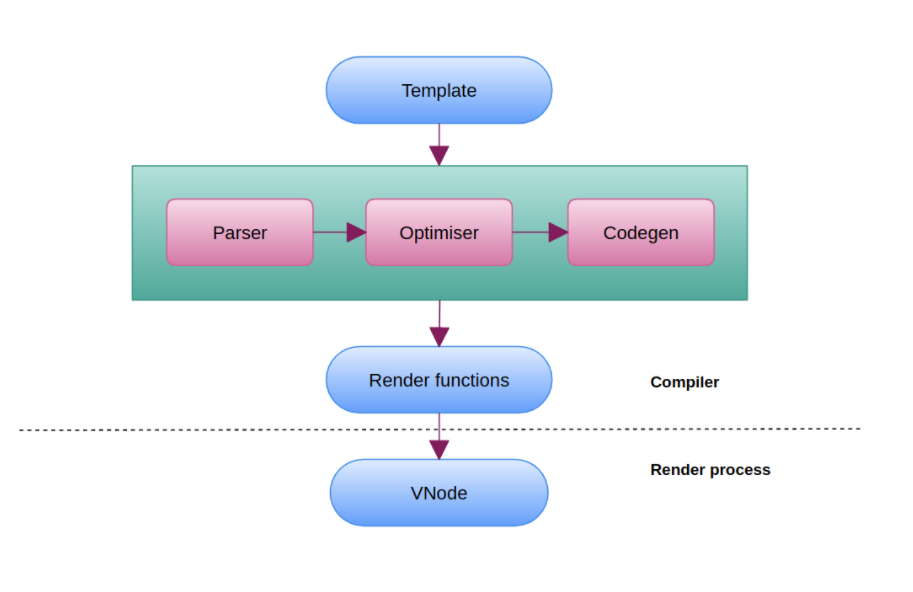
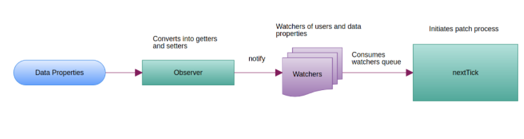

<!-- # Product and Cart Static Code Demo

This is one of the companion repos to the Vue.js course on the freeCodeCamp YouTube channel.
You can see the different stages of development by checking out the other branches.

**Other Repos from this Tutorial Series**

- [Static files from initial lessons](https://github.com/gwenf/vue3-fcc-course-static-code)
- [Vue CLI Product Cart Demo](https://github.com/gwenf/vue3-fcc-course-vue-cli-product-cart-demo)

Special thanks to [TheJaredWilcurt](https://github.com/TheJaredWilcurt) for helping out with the initial static code and doing pretty much all of the styling.
     -->

                                                                 Vue.js

Vue.js est un framework JavaScript pour la création d'applications et de sites Web. Il fournit des outils prêts à l'emploi pour nous aider à rendre nos sites Web et nos applications plus rapides et plus dynamiques. Et il nous donne également un ensemble de normes pour l'organisation du code.

Plugin Go Live permettant de montrer notre page HTML. Ce plugin rend les choses un peu plus faciles car il actualise automatiquement lorsque nous apportons des modifications au code. 

Template : affichage du contenu

J’obtiens toutes les données du tableau alimentaire food.json

                                                  Démystifier les composants interne de Vue.js

La phase de compilation :

Le compilateur Vue lit le modèle d'un composant, le fait passer par des étapes telles que l'analyse, l'optimisation, le codegen et crée finalement une fonction de rendu, comme indiqué ci-dessous. Cette fonction est responsable de la création d'un VNode qui est utilisé par le processus de correctif du DOM virtuel pour créer le DOM réel.

Étape d'analyse :

Cette étape de compilation joue avec le balisage envoyé comme modèle pour un composant particulier. Comme vous pouvez le voir sur l'image, tout d'abord l'analyseur analyse le modèle en analyseur HTML et le convertit à son tour en AST. (c'est-à-dire arbre de syntaxe abstraite ).

L'AST contient les informations telles que les attributs, le parent, les enfants, les balises, etc. Le processus d'analyse analysera les directives similaires aux éléments. Les directives structurelles telles que v-for , v-if, v-once seront représentées sous forme de paires clé-valeur dans l'AST pour un élément particulier. La directive v-if dans notre modèle, après l'analyse, sera poussée dans attrsMap en tant qu'objet comme {v-if : "dynamique"}.

Étape d'optimisation :

L'objectif de l'optimiseur est de parcourir l'AST généré et de détecter les sous-arbres qui sont purement statiques, c'est-à-dire les parties du DOM qui n'ont jamais besoin d'être modifiées. 
Une fois qu'il a détecté les sous-arbres statiques, Vue les hissera dans des constantes, de sorte que Vue ne créera pas de nouveaux nœuds pour eux à chaque nouveau rendu. Ces nœuds seront complètement ignorés pendant le processus de correction du DOM virtuel.

Étape CodeGen :

La dernière étape du compilateur est l'étape codegen, une étape où la fonction de rendu réelle sera créée et sera utilisée dans le processus de patch.

La hiérarchie des modèles a été convertie en hiérarchie des fonctions de rendu. Sur la base de l'indicateur statique fourni par l'optimiseur, le codegen divisera la fonction de rendu en 2 fonctions distinctes. L'une est une fonction de rendu simple et l'autre est une fonction de rendu statique.
À la fin, les fonctions de rendu seront utilisées pour créer un VNode tout en déclenchant le processus de rendu réel.

Remarque : La compilation du modèle aura lieu à l'avance si vous utilisez une étape de génération. par exemple, des composants de fichier unique.

                                             L'observateur et l'observateur — Composante réactive

Observateur :

Un observateur est créé pour chaque composant lorsqu'une application Vue est initialisée. Il analyse une expression, collecte les abonnés et déclenche un rappel lorsque la valeur de l'expression change. Ceci est utilisé à la fois pour l' API $watch et les directives. Chaque instance de composant a une instance d'observateur correspondante, qui enregistre toutes les propriétés comme "touchées" lors du rendu du composant en tant que dépendances. Plus tard, lorsque le setter d'une dépendance est déclenché, il en informe l'observateur, ce qui déclenchera finalement le processus de correctif.

Chaque fois qu'un changement de données est observé, il ouvre une file d'attente et met en mémoire tampon tous les changements de données qui se produisent dans la même boucle d'événements. Tous les observateurs sont ajoutés à la file d'attente. Chaque observateur a un identifiant unique dans un ordre incrémentiel, donc si le même observateur est déclenché plusieurs fois, il ne sera poussé dans la file d'attente qu'une seule fois et avant de le consommer, la file d'attente sera triée car l'observateur doit s'exécuter du parent à l'enfant.
En interne, Vue essaie un Promise.then natif et un MessageChannel pour la mise en file d'attente asynchrone avec setTimeout(fn, 0) .
La fonction nextTick consommera et videra tous les observateurs de la file d'attente. Une fois que tous les observateurs ont été consommés et vidés, le processus de rendu sera lancé à partir de la fonction run() de l'observateur.

Le processus de correction :

Le processus de patch est essentiellement un processus qui interagit efficacement avec le DOM réel à l'aide du DOM virtuel. Un DOM virtuel est juste un objet JavaScript qui représente un modèle d'objet de document (DOM). Vue.js utilise en interne la bibliothèque snabbdom . Alors, regardons ce qui se passe exactement dans ce processus de patch.

Le processus concerne le jeu de l'ancien VNode (Virtual DOM Node) et du nouveau VNode. En fin de compte, les deux seront comparés les uns aux autres.

L'algorithme fonctionnera de la manière suivante : 

1. Il vérifiera d'abord si l'ancien VNode est présent ou non et, si ce n'est pas le cas, créera l'élément DOM pour chaque VNode. Lorsque vous atterrissez pour la première fois dans l'application et que le premier processus de rendu démarre, dans ce cas, l'ancien VNode ne sera pas là.
2. Dans l'autre cas, si l'ancien VNode est présent, le processus de comparaison des enfants des deux commencera - Le nœud commun restera tel qu'il est dans DOM et le nouveau nœud sera ajouté et l'ancien nœud sans correspondance sera également supprimé de Virtual DOM. à partir du DOM réel.
3. De plus, les styles, la classe, l'ensemble de données et l'écouteur d'événements pour le nœud correspondant seront mis à jour (la nouvelle chose sera ajoutée ou les choses qui ne sont pas nécessaires seront supprimées) si nécessaire.

Le même processus aura lieu récursivement pour tous les nœuds.

De plus, je voudrais vous rappeler quelque chose - Le nœud statique, dont nous avons discuté à l'étape de l'optimiseur. L'arborescence du nœud statique sera intacte et utilisée telle quelle. La signification de ceci est - nous n'avons pas besoin d'interagir avec le DOM réel pour ce type d'arbre.

                                                                      DOM virtuel

1. DOM

Tout d’abord le DOM (Document Object Model) est une interface qui traite tout le langage de balisage (le HTML). 
Il permet d’écrire et de changer les styles des éléments. Comment ?
En ajoutant, modifiant ou supprimant des balises ou des styles CSS.

2. DOM virtuel vue.js

Il utilise divers algorithmes pour éviter de restituer l’intégralité du DOM après toute modification ou maj du document. 
Le DOM virtuel est plus intelligent, plus efficace et améliore la gestion des ressources que le DOM traditionnel.
