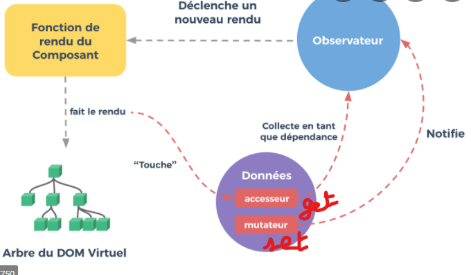

                                                                 Vue.js

Vue.js est un framework JavaScript pour la création d'applications et de sites Web. Il fournit des outils prêts à l'emploi pour nous aider à rendre nos sites Web et nos applications plus rapides et plus dynamiques. Et il nous donne également un ensemble de normes pour l'organisation du code.

Plugin Go Live permettant de montrer notre page HTML. Ce plugin rend les choses un peu plus faciles car il actualise automatiquement lorsque nous apportons des modifications au code. 

Template : affichage du contenu

J’obtiens toutes les données du tableau alimentaire food.json

                                                                      DOM virtuel

1. DOM

Tout d’abord le DOM (Document Object Model) est une interface qui traite tout le langage de balisage (le HTML). 
Il permet d’écrire et de changer les styles des éléments. Comment ?
En ajoutant, modifiant ou supprimant des balises ou des styles CSS.

2. DOM virtuel vue.js

Il utilise divers algorithmes pour éviter de restituer l’intégralité du DOM après toute modification ou maj du document. 
Le DOM virtuel est plus intelligent, plus efficace et améliore la gestion des ressources que le DOM traditionnel.

Vue utilise deux éléments : data blinding (La liaison de données est une technique utilisée pour lier les sources de données du fournisseur et du consommateur et les synchroniser au moment de la récupération. )et le DOM

                                            Démystifier les composants interne de Vue.js

1.   Étape d’analyse  

Cette étape consiste tout d’abord, l’analyseur analyse le modèle en analyseur HTML et le convertit en Arbre de Syntaxe Abstraite.
AST contient les attributs, le parent, les enfants, les balises etc..
Le processus d'analyse analysera les directives similaires aux éléments. Les directives structurelles telles que v-for , v-if, v-once (render function) seront représentées sous forme de paires clé-valeur dans l'AST pour un élément particulier. 

2.   Étape d’optimisation

L’optimisation permet de parcourir l’AST généré et de détecter les sous-arbres qui sont purement statiques. 
Une fois qu’il a détecté les sous-arbres statiques, la vue les hissera dans des constantes pour ne pas créer de nouveaux nœuds à chaque rendu. 

3.   Étape CodeGen
La dernière étape du compilateur est l'étape codegen, une étape où la fonction de rendu réelle sera créée et sera utilisée dans le processus de patch. 
À la fin, les fonctions de rendu seront utilisées pour créer un VNode tout en déclenchant le processus de rendu réel.

4.   Vnode

Tous les nœuds virtuels de l'arborescence des composants doivent être uniques.

5.   AST    

Exemple :  

    

        
        

    

    

6.   Observateur 

Un observateur dans Vue.js est une fonctionnalité spéciale qui permet de regarder un composant et d’effectuer des actions spécifiées lorsque la valeur du composant change.

Exemple :  

7.   CustomElementRegistry

Le contrôleur des éléments personnalisés sur un document Web est l' CustomElementRegistry. Cet objet nous permet d'enregistrer un élément personnalisé sur la page, de renvoyer des informations sur les éléments personnalisés qui sont enregistrés.

Pour enregistrer un élément personnalisé sur la page, vous utilisez la CustomElementRegistry.define(). Celui-ci prend comme arguments :

- A DOMStringreprésentant le nom que vous donnez à l'élément. 

- Un objet de classe qui définit le comportement de l'élément.

- Facultatif Un objet d'options contenant une extendspropriété.

Exemple de code : customElements.define('word-count', WordCount, { extends: 'p' });

L'élément s'appelle word-count, son objet de classe est WordCount, et il étend l' 
élément.